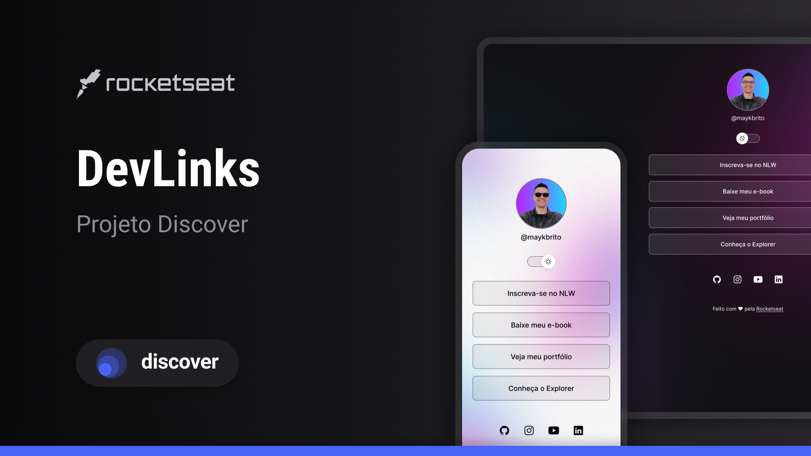

<h1 align="center">Dev. Links</h1>

Desolvivo por meio do curso gratuito "Discovery" da Rocketseat.

  

<h2>
  ## Técnologias
</h2>

  Este projeto foi desenvolvido com as seguintes tecnologias:

- HTML e CSS
- JavaScript
- Git e Github
- Figma

<h2>
  ## O projeto
</h2>

  O Dev. Links é um agregador de links para usar como cartão de visita online, desenvolvido no curso basico de JavaScript da Rocketseat.

<h2>
  ## Layout
</h2>
  Você pode acessar o layout do projeto através deste link: https://www.figma.com/file/vBQi0tZiDlM83oG7h5oGzW/DevLinks-%E2%80%A2-Projeto-Discover-(Community)?type=design&node-id=1437-191&mode=design&t=1TE3IvuRhdvsVN4i-0. É necessário ter conta no <strong>Figma</strong> https://figma.com para acessá-lo.

<h2>
  Este produto está sob a licença MIT.
</h2>
